# Full-Stack Docker Deployment Guide
## React (Vite) + Express + Docker + Nginx

A complete, production-ready full-stack application demonstrating modern deployment practices with comprehensive comments for learners at all levels.

**Project Structure:**
* `client/` — React (Vite) app
* `server/` — Express API
* `docker-compose.yml` — builds and runs both containers
* `client/nginx.conf` — nginx in front of the built frontend (and proxies `/api` to backend)

---

# 1 — Project tree (final structure)

```
full-stack-deploy/
├─ client/
│  ├─ src/
│  │  ├─ main.jsx
│  │  └─ App.jsx
│  ├─ index.html
│  ├─ package.json
│  ├─ vite.config.js
│  ├─ Dockerfile
│  └─ nginx.conf
├─ server/
│  ├─ index.js
│  ├─ package.json
│  └─ Dockerfile
└─ docker-compose.yml
```

---

# 2 — Backend (server)

## server/package.json

> Open terminal in `server` folder.

```npm
npm init -y
```
```
npm i express cors
```

```json
{
  "name": "server",
  "version": "1.0.0",
  "main": "index.js",
  "type": "module", //use import, not required type
  "scripts": {
    "start": "node index.js" //"node --watch index.js"
  },
  "dependencies": {
    "cors": "^2.8.5",
    "express": "^4.18.2"
  }
}
```

## server/index.js

- create a new file.

```js
// server/index.js
// Simple Express server with CORS enabled and one API route.

import express from "express";
import cors from "cors";

const app = express();

//middlewears - Parse JSON bodies (application/json)
app.use(express.json());

// Enable CORS for all origins.
// In production you might restrict this to your frontend domain.
app.use(cors());

// Example API route
app.get("/api/message", (req, res) => {
  // respond with JSON (frontend will fetch this)
  res.json({ message: "Hello from chaicode server" });
});

const PORT = process.env.PORT || 4000; // default port 4000
app.listen(PORT, () => {
  console.log(`Server is running at http://localhost:${PORT}`);
});
```

```
npm run start
```

> send `GET` request to `postman` http://localhost:4000 </br>
> Now try `GET` for http://localhost:4000/api/message

## server/Dockerfile

```Dockerfile
# server/Dockerfile
FROM node:22-alpine

WORKDIR /app

# copy package files and install dependencies
COPY package*.json ./
RUN npm install --production

# copy source
COPY . .

# expose the port the app runs on
EXPOSE 4000

# start the server
CMD ["npm", "start"]
```
> also add docker ignore.

```
docker build -t express-server .
```
```
docker run -p 4000:4000 express-server
```
> Test using `Postman`, the Backend is running good in Docker.</br>
> Also need port binding - `Default local host Port binding` in SERVER `index.js`.

```js
app.listen(PORT, "0.0.0.0", () =>
...
);
```

Notes:

* We enabled `cors()` for the server. That allows cross-origin requests from the browser to the API.
* In production you can restrict `cors({ origin: "https://my-site.com" })`.

---

# 3 — Frontend (client) — Vite + React (simple)

I use Vite for a minimal React example. The dev-time proxy will be described after files.
> Open Terminal in `Clint` folder.

```
npm create vite@latest .
```

- select `React`
- then `Js`
- rolldown `NO`
- npm `Yes`

## client/package.json

```json
{
  "name": "client",
  "version": "0.0.0",
  "private": true,
  "type": "module",
  "scripts": {
    "dev": "vite",
    "build": "vite build",
    "preview": "vite preview", 
    "start": "vite preview --port 3000"
  },
  "dependencies": {
    "react": "^18.2.0",
    "react-dom": "^18.2.0"
  },
  "devDependencies": {
    "vite": "^5.0.0"
  }
}
```

## client/vite.config.js

```js
// vite.config.js
// For development we can configure a proxy so CORS isn't needed during dev.
// This proxy only applies when running `npm run dev` (vite dev server).
import { defineConfig } from "vite";
import react from "@vitejs/plugin-react";

export default defineConfig({
  plugins: [react()],
  server: {
    port: 3000,
    // Proxy /api requests to the backend (dev convenience).
    // When using docker-compose production this is not used.
    proxy: {
      "/api": {
        target: "http://localhost:4000",
        changeOrigin: true,
        secure: false,
      },
    },
  },
});
```

Note: `vite`'s proxy is only for development convenience. In production we will serve the built static files via nginx and proxy `/api` requests to the backend on the docker network.

## client/index.html

```html
<!doctype html>
<html>
  <head>
    <meta charset="utf-8" />
    <title>Full Stack Deploy Demo</title>
  </head>
  <body>
    <div id="root"></div>
    <script type="module" src="/src/main.jsx"></script>
  </body>
</html>
```

## client/src/main.jsx

```jsx
import React from "react";
import { createRoot } from "react-dom/client";
import App from "./App";

createRoot(document.getElementById("root")).render(<App />);
```

## client/src/App.jsx

```jsx
import React, { useEffect, useState } from "react";

export default function App() {
  const [message, setMessage] = useState("loading...");

  useEffect(() => {
    // Fetch message from backend API
    // In development using vite proxy -> this will route to backend at localhost:4000
    // In production nginx will proxy "/api" to the backend service.
    fetch("/api/message")
      .then((res) => {
        if (!res.ok) throw new Error("Network response was not OK");
        return res.json();
      })
      .then((data) => {
        setMessage(data.message);
      })
      .catch((err) => {
        // show error friendly
        setMessage("Failed to fetch message: " + err.message);
      });
  }, []);

  return (
    <div style={{ padding: 20, fontFamily: "Arial" }}>
      <h1>Full-stack Deploy Demo</h1>
      <p>
        Message from backend: <strong>{message}</strong>
      </p>
    </div>
  );
}
```

<details>	
 <summary><b>Explain</b></summary>

Now Described exactly how a React frontend interacts with a Node backend using `fetch`, state management (`useState`), and `useEffect`.
Let’s now **update your `App.jsx`** with a fully commented version and a **Mermaid diagram** to visualize the process.

---

## 🧠 **Updated `App.jsx` with Detailed Comments**

```jsx
// Importing React hooks: useState for managing data, useEffect for running side effects (like fetching data)
import { useState, useEffect } from "react";

function App() {
  // Step 1️⃣: Create two pieces of state — one for message from backend, and one for a count example
  const [message, setMessage] = useState(""); // message received from backend
  const [count, setCount] = useState(0); // optional extra state (for local usage/demo)

  // Step 2️⃣: useEffect runs once when the component loads (because dependency array is empty [])
  useEffect(() => {
    // Fetch data from backend API running on port 4000
    fetch("http://localhost:4000/api/message")
      // The response from fetch is a ReadableStream, so we must convert it to JSON format
      .then((res) => res.json())

      // Once JSON is ready, extract only the 'message' property and set it to our message state
      .then((data) => setMessage(data.message))

      // Catch any network or JSON parsing errors
      .catch((error) => console.error("Error fetching message:", error));
  }, []); // Empty dependency array = this code runs only once (on component mount)

  // Step 3️⃣: Return the JSX structure for frontend rendering
  return (
    <>
      {/* Static heading */}
      <h1>Welcome to chaicode frontend</h1>

      {/* Display backend message dynamically */}
      <h2>Data: {message}</h2>

      {/* Example count display */}
      <p>Current Count: {count}</p>

      {/* A button to demonstrate local state change */}
      <button onClick={() => setCount(count + 1)}>Increase Count</button>
    </>
  );
}

// Step 4️⃣: Export App as default component
export default App;
```

---

## ⚙️ **Detailed Explanation (Line by Line)**

| Code Section                              | Purpose                                                                                |
| ----------------------------------------- | -------------------------------------------------------------------------------------- |
| `useState`                                | Creates local state variables. `message` for backend data, `count` for demo UI logic.  |
| `useEffect`                               | Executes side-effects (like API calls). With `[]`, it runs once after component mount. |
| `fetch()`                                 | Sends a GET request to the backend API (`http://localhost:4000/api/message`).          |
| `.then(res => res.json())`                | Converts the backend response (which comes as text) into a JSON object.                |
| `.then(data => setMessage(data.message))` | Extracts only the `message` key from the JSON and stores it in `message` state.        |
| `.catch(error => console.error(...))`     | Handles network or CORS-related errors gracefully in console.                          |
| `return (...)`                            | Displays both static and dynamic data on the frontend UI.                              |

---

## 🌐 **CORS Problem Overview**

When the frontend (React, port `5173`) calls the backend (Express, port `4000`), the browser **blocks** the request because of the **Same-Origin Policy**.

### Two Solutions:

1. **Frontend Proxy (Vite Config)**

   * Add this in `vite.config.js`:

     ```js
     server: {
       proxy: {
         "/api": "http://localhost:4000"
       }
     }
     ```
   * Now, frontend calls `/api/message` instead of full URL, and Vite automatically proxies it to backend.

2. **Backend CORS Setup**

   * In `index.js` (backend), configure `cors()`:

     ```js
     app.use(cors({
       origin: [
         "http://localhost:5173",
         "http://localhost:5174",
         "http://localhost:3000"
       ],
       credentials: true,
       methods: ["GET", "POST"],
       allowedHeaders: ["Content-Type", "Authorization"]
     }));
     ```
   * This explicitly allows the frontend origins and headers.

---

## 🧩 **Mermaid Diagram — Data Flow & Code Execution Timeline**

```mermaid
sequenceDiagram
    participant Browser as React Frontend (Port 5173)
    participant Server as Express Backend (Port 4000)
    participant Database as JSON Response

    Browser->>Browser: Component Loads
    Browser->>Browser: useEffect() triggers (no dependencies)
    Browser->>Server: fetch("http://localhost:4000/api/message")
    Server-->>Browser: JSON { message: "Hello from chaicode server" }
    Browser->>Browser: res.json() → converts to JS object
    Browser->>Browser: setMessage(data.message)
    Browser->>DOM: Rerenders with new message on screen
```



---

## 🧱 **Summary**

✅ **Frontend (`App.jsx`) does the following:**

* Loads once → triggers `useEffect`
* Fetches backend message via API
* Converts response to JSON
* Updates state → triggers re-render
* Displays result inside `<h2>`

✅ **Error Handling & CORS:**

* `catch()` ensures graceful error logging.
* Backend must have CORS setup to allow frontend port.
* Or, Vite proxy can route requests correctly.
  
</details>

---

# 4 — Production: client Dockerfile + nginx config (to serve static files and proxy API)

We build the frontend into static files (dist) and then use nginx to serve those static files. Nginx will also proxy `/api` to the backend container (by its docker-compose service name `backend`).

## client/Dockerfile

```Dockerfile
# client/Dockerfile
# 1) Build stage
FROM node:22-alpine AS build
WORKDIR /app
COPY package*.json ./
RUN npm install
COPY . .
RUN npm run build   # creates /app/dist

# 2) Production image: nginx serving the built files
FROM nginx:stable-alpine
# remove default nginx html content
RUN rm -rf /usr/share/nginx/html/*

# copy built static files
COPY --from=build /app/dist /usr/share/nginx/html

# copy our nginx config which proxies /api to the backend service
COPY nginx.conf /etc/nginx/conf.d/default.conf

EXPOSE 80
CMD ["nginx", "-g", "daemon off;"]
```

> add `Docker ignore`

## client/nginx.conf

```nginx
# client/nginx.conf
server {
    listen 80;
    server_name localhost;

    # serve the static frontend
    root /usr/share/nginx/html;
    index index.html;

    # if the frontend uses client-side routing, route missing files to index.html
    location / {
        try_files $uri $uri/ /index.html;
    }

    # proxy API requests to the backend service in docker-compose
    location /api/ {
        proxy_pass http://backend:4000/api/;
        proxy_http_version 1.1;
        proxy_set_header Host $host;
        proxy_set_header X-Real-IP $remote_addr;
        proxy_set_header X-Forwarded-For $proxy_add_x_forwarded_for;
        # optional: increase timeouts if backend takes longer
        proxy_connect_timeout 5s;
        proxy_read_timeout 60s;
    }

    # optional: gzip to reduce payload sizes
    gzip on;
    gzip_types text/plain application/json text/css application/javascript application/octet-stream;
}
```

Note:

* `proxy_pass http://backend:4000/api/;` points to the Docker service name `backend` which will be created by docker-compose (they are on the same network).
* `try_files` ensures SPA routing works (React router).

---

# 5 — docker-compose.yml

```yaml
version: "3.8"

services:
  backend:
    build:
      context: ./server
      dockerfile: Dockerfile
    container_name: fullstack_backend
    ports:
      - "4000:4000"   # expose to host for direct access if needed
    restart: unless-stopped

  client:
    build:
      context: ./client
      dockerfile: Dockerfile
    container_name: fullstack_frontend
    ports:
      - "80:80"   # serve frontend on host port 80
    restart: unless-stopped
    depends_on:
      - backend
```

Usage:

```bash
# from project root
docker compose up --build
# then open http://localhost in your browser -> frontend served by nginx.
# API endpoint http://localhost/api/message will be proxied to backend.
```

---

# 6 — Development vs Production details

**Development (fast local loop)**

* Use `npm run dev` inside client folder (Vite) and `npm start` in server folder.
* `vite.config.js` proxy sends `/api/*` to `http://localhost:4000`, so you can avoid CORS in dev.
* Command example (two terminals):

  ```
  cd server
  npm install
  npm start

  cd client
  npm install
  npm run dev
  ```
* The dev proxy is only for convenience — it’s not used in the Docker setup.

**Production**

* Build the client (`npm run build`) and serve `dist` via nginx (client image).
* Nginx proxies `/api` to the backend container on the docker network, so the browser talks only to nginx (same origin), preventing CORS in production.
* But we still left `cors()` enabled in backend — that's okay and useful for flexibility. If you prefer, restrict allowed origins in production.

---

# 7 — Common errors and solutions

**1) Browser CORS error (blocked by CORS policy)**

* Symptom: `Access to fetch at 'http://...' from origin 'http://localhost:3000' has been blocked by CORS policy`.
* Fixes:

  * In dev: use Vite's proxy (configured in `vite.config.js`) or set `proxy` in create-react-app package.json for CRA.
  * In backend: use `app.use(cors())` (we did).
  * In production: serve frontend and backend under same origin (nginx proxy) — then CORS is irrelevant.

**2) 404 on frontend client-side routes**

* Symptom: Refreshing `http://site/some-route` yields 404 from nginx.
* Fix: `try_files $uri $uri/ /index.html;` in nginx config to let the SPA handle route.

**3) Docker: `proxy_pass` not resolving `backend`**

* Symptom: nginx shows `host not found` or `502 Bad Gateway` when proxying.
* Fix:

  * Ensure `depends_on` in docker-compose so backend starts first (we added it).
  * Ensure `proxy_pass http://backend:4000` matches the service name in compose (`backend`) and port exposed inside container (server listens on 4000).
  * Check the backend container logs `docker compose logs backend`.

**4) Port conflict on host (e.g., port 80 in use)**

* Symptom: `Bind for 0.0.0.0:80 failed: port is already allocated`.
* Fix: change host mapping in compose `- "8080:80"` and open `http://localhost:8080`.

**5) “Module not found” or build errors for client**

* Symptom: `vite` build error or missing dependency.
* Fix:

  * Run `npm install` in client folder before building.
  * Check `package.json` and import paths in your code (case sensitivity matters in Linux).

**6) Docker build too large / caching dependencies**

* Fix:

  * Use `COPY package*.json` and `RUN npm install` before `COPY . .` to leverage Docker cache (we did).
  * Use `--production` when installing in production images so devDeps are not installed.

**7) Backend returns wrong path / trailing slash issues**

* Ensure nginx `proxy_pass` is correct regarding trailing slash. Our config uses `/api/` -> `.../api/` to keep path consistent.

---

# 8 — Quick checklist before you run

1. From repository root:

   * `cd server && npm install`
   * `cd ../client && npm install`
2. Build & run with Docker Compose:

   * `docker compose up --build`
3. Open the browser:

   * Production (Docker): `http://localhost` (or `http://localhost:8080` if you changed port)
   * Dev:

     * Frontend dev server: `http://localhost:3000`
     * Backend server: `http://localhost:4000` (API `http://localhost:4000/api/message`)

---

# 9 — Extra notes / explained flow (so you fully understand)

* **Dev proxy vs CORS**

  * Dev proxy (Vite) proxies `/api` requests from your dev server to backend so the browser’s origin remains `localhost:3000` and no CORS appears. Useful for dev only.
  * CORS on backend is safe to enable (and you can restrict allowed origins). In production, best practice is to serve frontend and backend through same origin (via nginx proxy, reverse proxy or same domain), eliminating the need for CORS.

* **Why multistage build for the client?**

  * We build with Node then copy only the production `/dist` into a small nginx image. This keeps the final image small.

* **Proxy in nginx**

  * When the browser requests `/api/message`, nginx will forward it to `http://backend:4000/api/message` inside the docker network. The browser sees a single origin (nginx host) and so there is no CORS.

* **Network names**

  * Docker Compose creates a default network. Each service is discoverable by its service name (`backend`, `client`) from within containers.

---

Which follow-up would you like?
